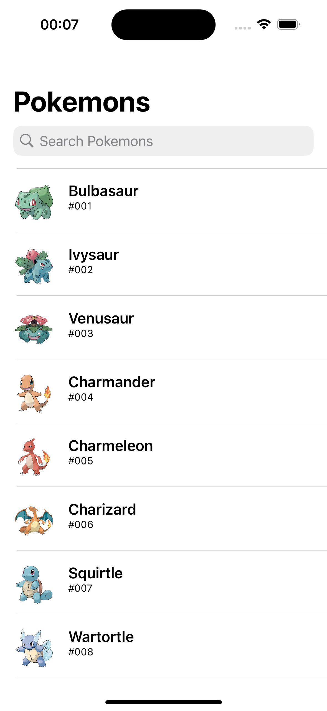
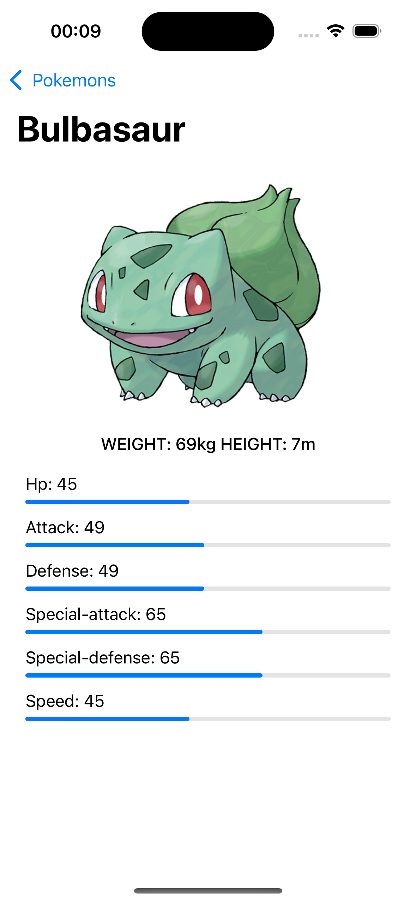
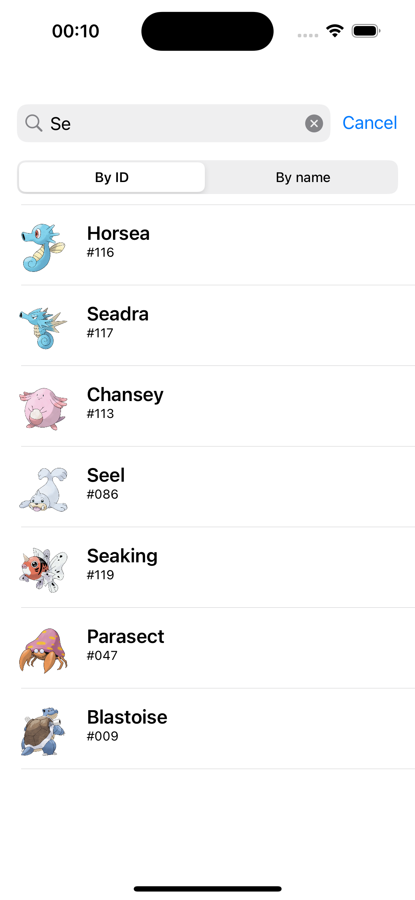
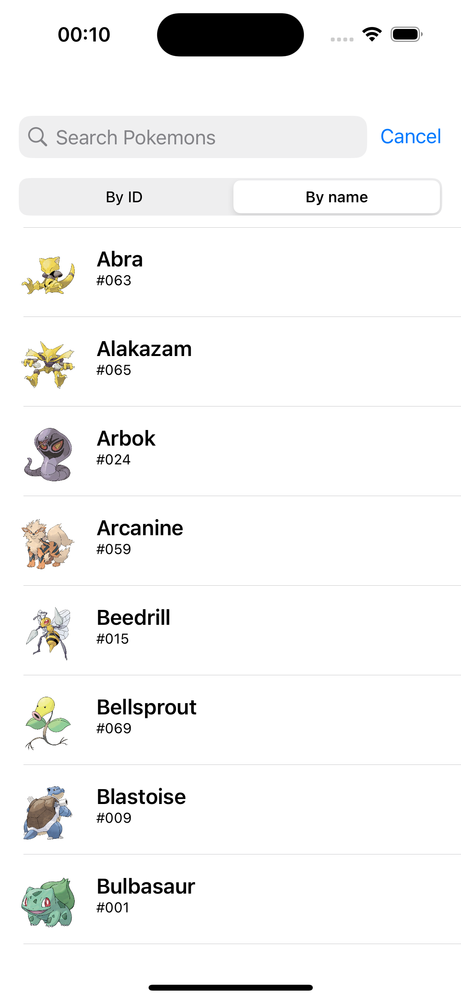

  

<h1>
  Pokedox IOS
</h1>

### Тестовое задание от 25.10

Выполнил: Мизюлин Егор 
tg: [@egormzln](https://t.me/egormzln)

#### Критерии:

- [x] Экран ленты
- [x] Экран детального описания
- [x] Поиск
- [x] Сортировка
- [x] Верстка только кодом без SUI
- [x] Не использовать Pods и SPM
- [x] Минимальный таргет 15.6

### Дополнительно:

- [x] Реализована пагинация списка с PokeApi

#### Установка и запуск

1.  `git clone https://github.com/tw0ch/labmedia-test-task.git`
2.  Откройте `TestLabmedia.xcodeproj` в Xcode.
3.  Выберите целевое устройство или симулятор и нажмите кнопку запуска.

#### Скриншоты

| 
Лента
          | 
Детальное описание
 |
| ---------------------------------------------------- | -------------------------------------------------------- |
|  |   |

| 
Поиск
            | 
Сортировка
     |
| ------------------------------------------------------ | ---------------------------------------------------- |
|  |  |
